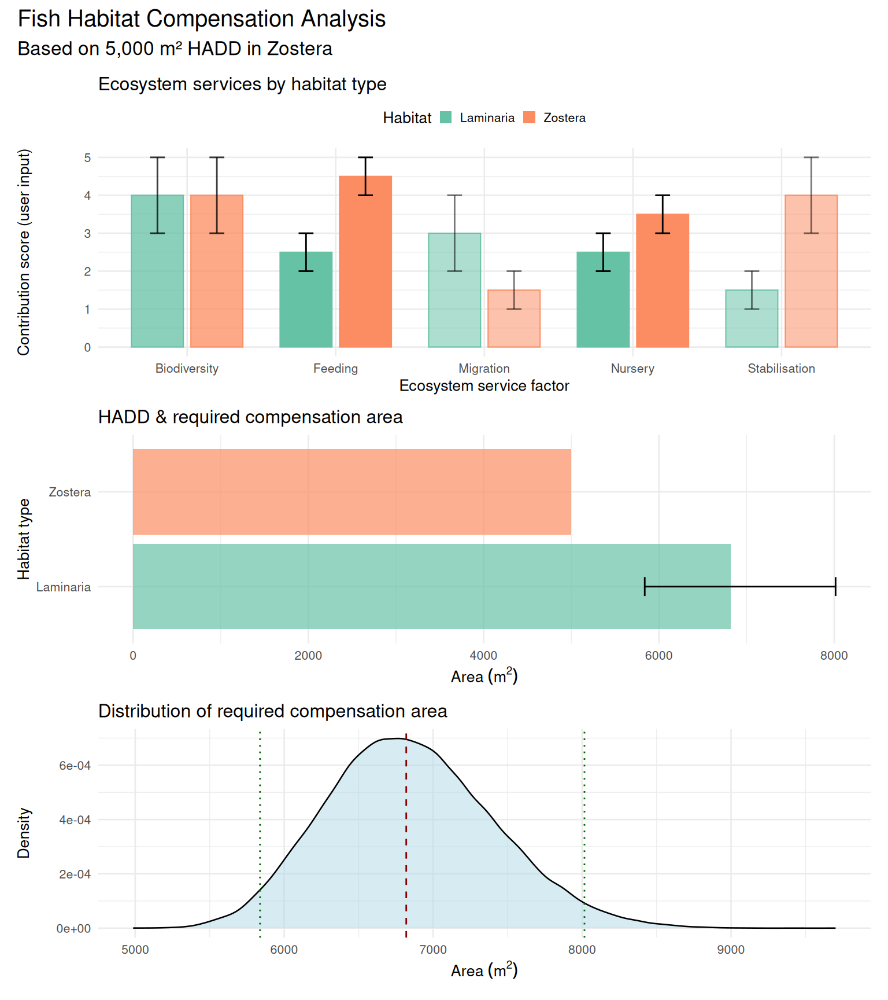

## Summary / Sommaire

*A simulation tool has been developed to support decision-making on fish
habitat compensation projects in Canada consistent with the Fisheries
Act. The tool considers the fish habitat support capacity of the HADD
habitat and the potential compensation habitat along several axes. Those
capacities are scored on a Likert Scale from 0 to 5 along each axis by
an analyst using evidence from the scientific literature, previous
compensation projects and expert knowledge. The analyst also scores the
relative importance of each axis for its contribution the decision
making process on compensation. Simulations are performed accounting for
the uncertainty in the scores provided by the analysts and a
distribution of compensation ratios results to inform the scale of the
compensation project(s) required to offset the HADD. The distribution of
outcomes allows the work to be interpreted within a risk framework
consistent with policy following from the Fisheries Act. In addition to
considering direct compensation projects, this tool can be used to
derive compensation ratios between any number of habitat pairs as well
as determine the compensation value of previously banked habitats at the
time of ‘withdrawal’ to offset a HADD.*

------------------------------------------------------------------------

*Un outil de simulation a été développé pour soutenir la prise de
décision dans les projets de compensation d’habitats pour les poissons
au Canada, conformément à la Loi sur les pêches. L’outil prend en compte
la capacité de soutien de l’habitat HADD et de l’habitat de compensation
potentiel selon plusieurs axes. Ces capacités sont évaluées sur une
échelle de Likert de 0 à 5 pour chaque axe par un analyste, en
s’appuyant sur des données issues de la littérature scientifique, des
projets de compensation précédents et des connaissances expertes.
L’analyste attribue également un score à l’importance relative de chaque
axe en fonction de sa contribution au processus décisionnel en matière
de compensation. Des simulations sont réalisées en tenant compte de
l’incertitude des scores fournis par les analystes, et une distribution
des ratios de compensation en résulte pour informer l’ampleur des
projets de compensation nécessaires afin de compenser le HADD. La
distribution des résultats permet d’interpréter le travail dans un cadre
de gestion des risques conforme à la politique découlant de la Loi sur
les pêches. En plus d’évaluer les projets de compensation directs, cet
outil peut être utilisé pour dériver des ratios de compensation entre
plusieurs paires d’habitats et pour déterminer la valeur de compensation
d’habitats préalablement « bancarisés » lors de leur « retrait » afin de
compenser un HADD.*

## Acronym and explanation

### English

C.H.A.R.T. – Compensation Habitat Assessment and Ratio Tool

    Compensation: the primary focus of the tool.
    Habitat: central to the Fisheries Act mandate.
    Assessment: structured scoring approach.
    Ratio: derived compensation ratios between habitat pairs.
    Tool: decision-support simulation framework.

### Français

C.H.A.R.T. – Compensation, Habitat, Analyse, Ratios, et Trame

    Compensation : l'objectif principal de l'outil.
    Habitat : central au mandat de la Loi sur les pêches.
    Analyse : approche structurée de notation des critères.
    Ratios : ratios de compensation dérivés entre les habitats comparés.
    Trame : cadre de simulation et de soutien à la prise de décision.

## Introduction

Under the Fisheries Act, any work undertaking or activity (WUA - see
definition below) resulting in a harmful alteration, disruption or
destruction of fish habitat (HADD see definition below) above a
threshold level requires compensation/offset. The ecosystem service
factor (ESF) considered in the compensation are partially outlined in
the Fisheries Act but not all potential ESFs. The method outlined here
is an example of how various ESFs could be integrated in a scoring-based
approach to determine the scale of compensation required given the
characteristics of the HADD owing to a WUA and the proposed compensation
project to offset that HADD. Thus, this decision support tool was
developed to make that process more transparent and to include
uncertainty in knowledge of the biological processes.

**Disclaimer**  
This is just a proof of concept and not based on data, a thorough review
of the literature or knowledge from multiple experts. It is designed to
show how a decision-making process could include a scoring-based tool as
support to inform the scale of the compensation project required to
offset a HADD. This should not be used as is and needs proper checking
and parameterisation before real-world usage.

### Definitions

**Compensation**: refers to measures taken to offset the adverse effects
of activities that harm fish or fish habitat. This is particularly
relevant when an activity results in a HADD of fish habitat or death of
fish. Compensation is typically part of a broader plan to maintain the
productivity and sustainability of fish habitats and fisheries. It
involves actions such as restoration of degraded habitats, enhancement
of existing habitat, creation new habitat, and protection of existing
habitat.

**Compensation ratio**: the habitat compensation ratio refers to the
proportion of habitat that must be restored, enhanced, or created to
compensate for habitat that has been harmed, altered, disrupted, or
destroyed (HADD) due to a work, undertaking or activity (WUA). This is
usually defined in practice as a measure of area of the compensation
divided by the area of the HADD.

**Ecosystem service factors (ESF)**: are variables or axes that are
considered important for decision-making for compensation under the
Fisheries Act. ESF can be processes or characteristics of a habitat that
provide a service to nature consider useful for human use. For example a
habitat’s capacity to support juvenile fish rearing could be considered
a nursery ESF. A near shore sandbank habitat might be considered a
coastal erosion protection ESF.

**Fish habitat** means water frequented by fish and any other areas on
which fish depend directly or indirectly to carry out their life
processes, including spawning grounds and nursery, rearing, food supply
and migration areas (FA - definitions).

**Harmful alteration, disruption or destruction of fish habitat
(HADD)**: the Fisheries Act prohibits the harmful alteration, disruption
or destruction of fish habitat commonly referred to as HADD. A HADD
results from any human activity or WUA (see below). A HADD could be an
impact on areas essential for fish survival, such as spawning grounds,
nursery areas, and migration routes.

**Offset**: effectively the same as Compensation.

**Work, undertaking or activity (WUA)** is a prescribed work,
undertaking or activity or belongs to a prescribed class of works,
undertakings or activities, as the case may be, or is carried on in or
around prescribed Canadian fisheries waters, and the work, undertaking
or activity is carried on in accordance with the prescribed conditions
(FA 34.4.2a).

## Decision Making Under the Fisheries Act

### General considerations for decision making, Fisheries Act section 2.5

Except as otherwise provided in this Act, when making a decision under
this Act, the Minister may consider, among other things:

1.  the application of a precautionary approach and an ecosystem
    approach;
2.  the sustainability of fisheries;
3.  scientific information;
4.  Indigenous knowledge of the Indigenous peoples of Canada that has
    been provided to the Minister;
5.  community knowledge;
6.  cooperation with any government of a province, any Indigenous
    governing body and any body — including a co-management body —
    established under a land claims agreement;
7.  social, economic and cultural factors in the management of
    fisheries;
8.  the preservation or promotion of the independence of licence holders
    in commercial inshore fisheries; and
9.  the intersection of sex and gender with other identity factors.

### Specific factors that shall be considered, Fisheries Act section 34.1

The Minister, prescribed person or prescribed entity, as the case may
be, shall consider the following factors:

1.  the contribution to the productivity of relevant fisheries by the
    fish or fish habitat that is likely to be affected;
2.  fisheries management objectives;
3.  whether there are measures and standards:
    1.  to avoid the death of fish or to mitigate the extent of their
        death or offset their death, or
    2.  to avoid, mitigate or offset the harmful alteration, disruption
        or destruction of fish habitat;
4.  the cumulative effects of the carrying on of the work, undertaking
    or activity referred to in a recommendation or an exercise of power,
    in combination with other works, undertakings or activities that
    have been or are being carried on, on fish and fish habitat;
5.  any fish habitat banks, as defined in section 42.01, that may be
    affected;
6.  whether any measures and standards to offset the harmful alteration,
    disruption or destruction of fish habitat give priority to the
    restoration of degraded fish habitat;
7.  Indigenous knowledge of the Indigenous peoples of Canada that has
    been provided to the Minister; and
8.  any other factor that the Minister considers relevant.

## Calculating compensation area required to offset a HADD

A method has been developed to provide a systematic and quantitative
method for estimating the required compensation area for habitat loss
(HADD) even without fully quantitative knowledge and data. It addresses
scenarios where a habitat becomes partially or fully unavailable to
fulfill its ecological function as a fish habitat; therefore, a new or
existing habitat must be enhanced or restored as compensation. The goal
is to balance the ecological functions and services lost in the original
habitat with those provided by the compensation area. This function is
particularly useful for decision-makers, ecologists, and planners who
need to evaluate trade-offs and ensure that compensation efforts are
ecologically meaningful and defensible and to facilitate a conversation
about uncertainty thus creating a transparent decision support tool for
fish habitat compensation projects and habitat banking.

The core purpose of the method is to incorporate variability and
uncertainty to calculate compensation ratios between habitats. It
achieves this by considering multiple ecological or functional factors
that contribute to habitat value (e.g., biodiversity, productivity, or
resilience). These factors are given relative importance through
user-defined weights and are evaluated across both the HADD and
compensated habitats. By doing so, the function ensures that the
compensation calculation reflects the multifaceted nature of habitat
quality and the inherent differences between habitats. The weights
assigned to the different factors corresponds to the importance in
decision making assigned to these ecological factors and their ecosystem
service function.

The method employs Monte Carlo simulations to address variability and
uncertainty in the ESF scores. For each simulation, random values are
sampled from user-defined ranges for each ESF in both the HADD and
compensation habitats. These scores are combined using weighted
averages, reflecting the relative importance of each ESF for decision
making[1]. The destruction area’s size is then scaled by the ratio of
the weighted scores of the destroyed and compensated habitats, providing
an adjusted compensation area for each simulation.

The outputs of the function include key statistical metrics such as the
mean, median, and standard deviation of the simulated compensation
areas, as well as a confidence interval around these estimates. These
metrics provide decision-makers with a clear understanding of the
expected compensation area and the uncertainty associated with it.
Additionally, the function returns the raw simulated areas, which can be
used for further analysis or visualization.

Users can define up to five ESF, with ranges importance score ranges for
both the HADD and compensation habitats. The relative importance of
these ESF in the decision process are provided by the user. The weights
are the weights in the decision making process and therefore reflect
things such legislation, policy, management objectives and stakeholder
priorities and the question relative to the two habitat being
considered. For instance, in one scenario, biodiversity might be given
the highest weight, while in another, ESFs like sediment stabilization
or fish feeding area might take precedence.

The method is general and not tied to any specific habitat type or
ecological context, making it applicable across a wide range of
ecosystems and compensation scenarios. By incorporating stochastic
sampling and allowing for customised parameters, the method provides a
framework for estimating compensation requirements that accounts for
both ecological complexity and uncertainty. This makes it a tool to
examine no net loss or net gain of ecological function, a cornerstone
principle in habitat management and environmental impact mitigation
under the Fisheries Act.

The method bridges the gap between theory and practice by offering a
transparent, repeatable, and scientifically grounded approach to
compensation area calculation. Its reliance on stochastic methods
ensures that variability and uncertainty are explicitly considered.

## Proof-of-concept example (scores and weights are not based on evidence)

This example considers a hypothetical situation where the destruction of
a Zostera eelgrass bed is to be compensated or offset by building a
Laminaria kelp reef. The analyst needs to decide what ESFs should be
considered in such a process. In this case, we chose to consider each of
these habitats for five ESFs, which can generally be thought of as
contributions to ecosystem services:

1.  As Biodiversity support in the system generally
2.  As a Feeding area for fish (fish as defined by the Fisheries Act)
3.  As a Migration area for fish in transit
4.  As a Nursery area for fish
5.  As a Stabilisation habitat that prevents coastal erosion

For each of these ESFs, the analyst needs to weight their importance in
the decision support process. For example, Feeding and Nursery support
functions may be considered the most important, while Biodiversity is
the next most important, and Migration and Stabilisation are the least
important of the five ESFs. Therefore, weights are assigned accordingly
and should sum to 1. These weights are essentially decision-process
weights rather than direct biological contribution weights. The weights
should reflect what the Fisheries Act (Government of Canada, 2019) and a
fish habitat manager think is the relative importance of each ESF in the
decision-making process. This is why there is a single weight assigned
to each ESF regardless of the habitat type. This approach differs
slightly from the contribution of an ecosystem function to ecosystem
health, as that aspect is addressed through scoring.

The weights are fixed and are intentionally not resampled from a range.
If they were resampled, it would imply the decision-making body lacks
the capacity to make consistent decisions based on evidence. If the
decision-making body cannot provide definitive weights, the issue goes
beyond developing a decision-support tool. However, a different kind of
analysis could include institutional uncertainty in the decision-making
process where the weights could be sampled from a distribution. Such an
exercise includes a broader range of questions about decision-making
generally. We have deliberately not implemented this because it
considerably complexifies the question on the use of such a tool even
though it is easy to code.

The analyst must provide a contribution score range for each ESF for
each habitat type, that is, for both the HADD habitat and the
compensation habitat. The analyst may not know exactly how important an
eelgrass habitat is for its role as fish nursery habitat, but they know
from the literature that this is an important function of eelgrass
habitats. Consequently, they might rank it from 3 to 4 (with 5 being the
maximum), while kelp reefs may be less important for this function in
eastern Canada but still significant, resulting in a rank of 2 to 3.

Once the ESFs are chosen, the weights assigned to each ESF in the
decision-making process, and score ranges developed for both the HADD
and compensation habitats, the model can be run. The model simulates
scores over a number of iterations (e.g., 1000), sampling from the
specified ranges for each ESF using a uniform distribution. These
sampled scores are weighted by their assigned weights, and the ratio of
the weighted scores of the HADD habitat to the compensation habitat is
calculated, yielding a compensation ratio with an associated range. This
compensation ratio is then multiplied by the area of the HADD habitat to
determine the compensation habitat area needed to offset the HADD. The
uncertainty in the scores allows for calculating a mean value and
confidence interval for the required compensation area, ultimately
resulting in a distribution of potential compensation areas.

*Table 1: User score can range from 0 to 5 where 5 is a key ecosystem
service. The evidence citation for its importance and the weight of that
ecosystem service in the decision making process relative to other named
services. Each ecosystem service factor must have a weight in the
decision-making process which can be zero. Weights for each service will
be the same for both habitats.*

<table>
<colgroup>
<col style="width: 25%" />
<col style="width: 28%" />
<col style="width: 24%" />
<col style="width: 22%" />
</colgroup>
<thead>
<tr>
<th style="text-align: left;"><strong>Ecosystem service</strong></th>
<th style="text-align: center;"><strong>Importance score
range</strong></th>
<th style="text-align: center;"><strong>Evidence</strong></th>
<th style="text-align: center;"><strong>Decision weight</strong></th>
</tr>
</thead>
<tbody>
<tr>
<td style="text-align: left;"><em>Zostera (HADD)</em></td>
<td style="text-align: center;"></td>
<td style="text-align: center;"></td>
<td style="text-align: center;"></td>
</tr>
<tr>
<td style="text-align: left;">   Biodiversity</td>
<td style="text-align: center;">3-5</td>
<td style="text-align: center;">publication</td>
<td style="text-align: center;">0.2</td>
</tr>
<tr>
<td style="text-align: left;">   Feeding</td>
<td style="text-align: center;">4-5</td>
<td style="text-align: center;">publication</td>
<td style="text-align: center;">0.3</td>
</tr>
<tr>
<td style="text-align: left;">   Migration</td>
<td style="text-align: center;">1-2</td>
<td style="text-align: center;">publication</td>
<td style="text-align: center;">0.1</td>
</tr>
<tr>
<td style="text-align: left;">   Nursery</td>
<td style="text-align: center;">3-4</td>
<td style="text-align: center;">publication</td>
<td style="text-align: center;">0.3</td>
</tr>
<tr>
<td style="text-align: left;">   Coastal Stabilisation</td>
<td style="text-align: center;">3-5</td>
<td style="text-align: center;">publication</td>
<td style="text-align: center;">0.1</td>
</tr>
<tr>
<td style="text-align: left;"></td>
<td style="text-align: center;"></td>
<td style="text-align: center;"></td>
<td style="text-align: center;"></td>
</tr>
<tr>
<td style="text-align: left;"><em>Laminaria (Offset)</em></td>
<td style="text-align: center;"></td>
<td style="text-align: center;"></td>
<td style="text-align: center;"></td>
</tr>
<tr>
<td style="text-align: left;">   Biodiversity</td>
<td style="text-align: center;">3-5</td>
<td style="text-align: center;">publication</td>
<td style="text-align: center;">0.2</td>
</tr>
<tr>
<td style="text-align: left;">   Feeding</td>
<td style="text-align: center;">2-3</td>
<td style="text-align: center;">publication</td>
<td style="text-align: center;">0.3</td>
</tr>
<tr>
<td style="text-align: left;">   Migration</td>
<td style="text-align: center;">2-4</td>
<td style="text-align: center;">publication</td>
<td style="text-align: center;">0.1</td>
</tr>
<tr>
<td style="text-align: left;">   Nursery</td>
<td style="text-align: center;">2-3</td>
<td style="text-align: center;">publication</td>
<td style="text-align: center;">0.3</td>
</tr>
<tr>
<td style="text-align: left;">   Coastal Stabilisation</td>
<td style="text-align: center;">1-2</td>
<td style="text-align: center;">publication</td>
<td style="text-align: center;">0.1</td>
</tr>
</tbody>
</table>

    destruction_area <- 5000  # m²

    factor_names <- c("Biodiversity", "Feeding", "Migration", "Nursery", "Stabilisation")

    weights <- c(0.2, 0.3, 0.1, 0.3, 0.1)  # Weights for each factor

    # Factor score ranges for destroyed habitat
    factor_ranges_destroyed <- list(
      factor1 = c(3, 5),  # biodiversity
      factor2 = c(4, 5), # feeding
      factor3 = c(1, 2), # migration
      factor4 = c(3, 4), # nursery
      factor5 = c(3, 5) # sediment stabilisation
    )

    # Factor score ranges for compensated habitat
    factor_ranges_compensated <- list(
      factor1 = c(3, 5),  # biodiversity
      factor2 = c(2, 3), # feeding
      factor3 = c(2, 4), # migration
      factor4 = c(2, 3), # nursery
      factor5 = c(1, 2) # sediment stabilisation
    )

    # Run the function
    result <- calculate_compensation_area(
      destruction_area = destruction_area, 
      factor_ranges_destroyed = factor_ranges_destroyed, 
      factor_ranges_compensated = factor_ranges_compensated, 
      weights = weights,
      num_simulations = 50000, 
      quantiles = c(0.025, 0.975), 
      habitat_names = c("Zostera", "Laminaria"), 
      factor_names = factor_names
    )

    # Example visualization
    plot_compensation_analysis(result, quantiles = c(0.025, 0.975))

*Figure 1: A proof-of-concept simulation for a fish compensation project
where a Laminaria (kelp) reef is built to compensate/offset a Zostera
(eelgrass) bed HADD. The user is required to score a range of the level
of contribution for an ecosystem service factor from 0 to 5 and assign a
weight from 0 to 1 for the importance of each of the factors in the
decision support process. The opacity of the bars in the top panel is
proportional to the importance weight assigned to a factor (more opaque
is more important). The middle panel shows how much habitat is needed to
compensate for the HADD and the bottom panel shows the distribution of
the compensation area needed given the uncertainty in the ecosystem
service factor scores and importance weights assigned to each factor.
The vertical lines on the bottom panel represent the 2.5th, 50th and
97.5th percentiles of the distribution of required compensation area.*

The example shows that given the ESFs, their score ranges and weights, a
5000 m² HADD in an Zostera bed would require a mean value (50% chance of
no net loss) of about 6818 m² of Laminaria offset to compensate for it
(Fig. 1). Given the uncertainty in the ESF scores, the 2.5th and 97.5
quantile confidence intervals give a range of 5840 m² and 8030 m²,
respectively. The compensation ratio Zostera/Laminaria in this
hypothetical example with a 95% confidence interval is 1.17 ≤ 1.36 ≤
1.61. That means Zostera (in this hypothetical example only) has a value
as a habitat of equal area that is 1.36 times more important than
Laminaria on average but it could be as low as 1.17 times or as much as
1.61 times greater.

The distribution of the compensation area could be used to determine a
quantile other than 50% (the median compensation) if one were required
to offset a HADD with a great probability of fully offsetting the HADD.
that is, one might choose a compensation larger than 50% (equal chance
of over- or under-offsetting) to assure that the intended offset is
achieved. The process is directly a risk (based on uncertainty) process
where one could choose the 97.5 percentile of the compensation area
(largest extent of error bar in panel 2 of Fig. 1 = 8030 m²) to
statistically assure that a HADD is fully offset by the compensation
project.

## Real world application

To apply this in a real situation, an analyst would need to:

1.  Determine what are the important ESFs for the decision making
    process.
2.  Weigh the relative importance of each ESF in the decision making
    process. This is partially written into the Fisheries Act already
    when it names what is important to preserve. Other ESFs and their
    weights could come about through discussions between analysts and
    managers and being cognisant of things such as MPAs, EBSAs, SARA
    species and Indigenous areas of interest.
3.  Score each of the ESFs for their contribution to ecosystem health.
    This will be primarily based on literature search, expert knowledge
    and outcomes of previous compensation projects.
4.  Run the model with this parameterisation and the known area of the
    HADD and the proposed compensation area and project.

One could potentially compensate for the HADD with a series of different
projects by running this tool for just a proportion of a HADD and one
compensation area at a time and offset the remainder of the HADD in
another area by using this tool again to determine the level of offset
required.

### Number of ESF to consider

The present tool by default has five ESF that can influence the
determination of a compensation. The suite of ESF do not need to capture
all the ecosystem functions provided by a habitat, just those that are
considered important by the Fisheries Act, the analyst and interest
holders. Many ESF are also likely highly correlated therefore, we see
very little use and some danger in trying to include more than five ESF.
Using several correlated ESFs will overweight a decision towards a
particular general super-axis. Therefore it is important that the
analyst carefully consider what is of prime importance for the decision
making process. The weighting of each ESF is therefore very important
and a zero weight is a very useful way to eliminate axes from the
decision making process. The score on every axis with a positive weight
needs to be researched and supported and therefore one would be wise to
consider all weights equal to zero without evidence to the contrary.

## A general tool for determining compensation ratios and habitat bank equivalency

This tool is simply a means of determining a compensation ratio between
two habitat types according to ESFs deemed important for ecosystem
health and decision making under the Fisheries Act. If one uses the tool
with a HADD area of 1 m², the tool will just produce a compensation
ratio between two habitat types. One could therefore develop a database
of compensation ratios by applying this tool for many pairs of habitat
types. There may be little benefit in creating such as database,
however, as new information may become available and could be
incorporated in new analyses on both the weight of ESFs in decision
making and the importance of ESFs in ecosystem health. The tool is also
relatively easy and fast to run and therefore there is little advantage
in trying to front-load analyses by creating a database of compensation
ratios which are likely to change with arrival of new information.

The value of deposits in a habitat bank could be assessed at the time of
withdrawal from the bank using such a tool.

The most difficult part of the process is its subjectivity in scoring
and founding those scores in evidence. However by assigning a range to
scores, uncertainty can be accounted for and the distribution of the
compensation area transparently reflects this uncertainty. A manager
therefore can determine which might be the best compensation-area
quantile to choose and this tool at least facilitates a conversation
about it. In fact, to account for the uncertainty, a decision maker
should probably use a larger percentile than 50% since 50% is just equal
probability of being above or below a no net loss compensation, i.e. it
has only a 50% chance of fully compensating for the HADD.

[1] weights for decision making are not necessarily importance weights
for ecological function though they should be roughly similar as
legislated protections leading to the policy for decision making likely
follows from importance as an ecosystem service.
