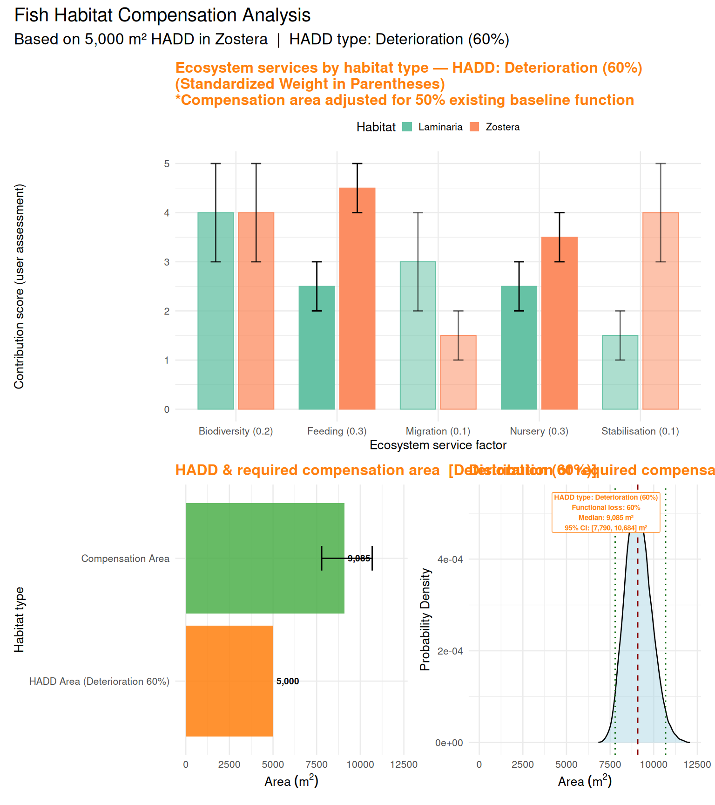
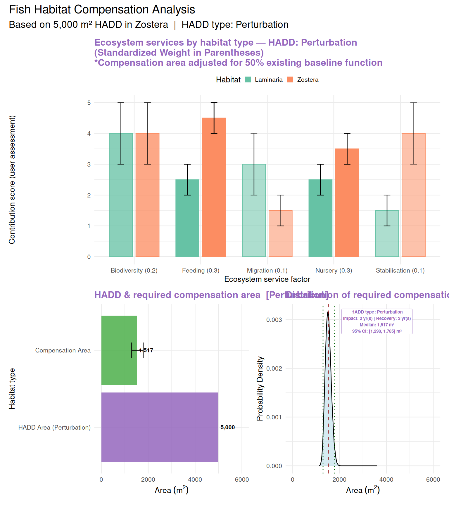

------------------------------------------------------------------------

# Quick start

Try the [bilingual shiny app](https://duplisea.shinyapps.io/CHART/)

<https://duplisea.shinyapps.io/CHART/>

# Summary / Sommaire

*A simulation tool has been developed to support decision-making on fish
habitat compensation projects in Canada consistent with the Fisheries
Act. The tool considers the fish habitat support capacity of the HADD
habitat and the potential compensation habitat along several axes. Those
capacities are scored on a Likert Scale from 0 to 5 along each axis by
an analyst using evidence from the scientific literature, previous
compensation projects and expert knowledge. The analyst also scores the
relative importance of each axis for its contribution to the decision
making process on compensation. The tool explicitly recognises three
types of HADD — permanent destruction, permanent partial deterioration,
and temporary perturbation — each with its own compensation formula.
Simulations are performed accounting for the uncertainty in the scores
provided by the analysts and a distribution of compensation areas
results to inform the scale of the compensation project(s) required to
offset the HADD. The distribution of outcomes allows the work to be
interpreted within a risk framework consistent with policy following
from the Fisheries Act. In addition to considering direct compensation
projects, this tool can be used to derive compensation ratios between
any number of habitat pairs as well as determine the compensation value
of previously banked habitats at the time of ‘withdrawal’ to offset a
HADD.*

------------------------------------------------------------------------

*Un outil de simulation a été développé pour soutenir la prise de
décision dans les projets de compensation d’habitats pour les poissons
au Canada, conformément à la Loi sur les pêches. L’outil prend en compte
la capacité de soutien de l’habitat APDN et de l’habitat de compensation
potentiel selon plusieurs axes. Ces capacités sont évaluées sur une
échelle de Likert de 0 à 5 pour chaque axe par un analyste, en
s’appuyant sur des données issues de la littérature scientifique, des
projets de compensation précédents et des connaissances expertes.
L’analyste attribue également un score à l’importance relative de chaque
axe en fonction de sa contribution au processus décisionnel en matière
de compensation. L’outil reconnaît explicitement trois types d’APDN —
destruction permanente complète, détérioration permanente partielle et
perturbation temporaire — chacun avec sa propre formule de compensation.
Des simulations sont réalisées en tenant compte de l’incertitude des
scores fournis par les analystes, et une distribution des surfaces de
compensation en résulte pour informer l’ampleur des projets de
compensation nécessaires afin de compenser l’APDN. La distribution des
résultats permet d’interpréter le travail dans un cadre de gestion des
risques conforme à la politique découlant de la Loi sur les pêches. En
plus d’évaluer les projets de compensation directs, cet outil peut être
utilisé pour dériver des ratios de compensation entre plusieurs paires
d’habitats et pour déterminer la valeur de compensation d’habitats
préalablement « bancarisés » lors de leur « retrait » afin de compenser
une APDN.*

------------------------------------------------------------------------

# Acronym and explanation

## English

C.H.A.R.T. – Compensation Habitat Assessment and Ratio Tool

- **Compensation:** the primary focus of the tool.
- **Habitat:** central to the Fisheries Act mandate.
- **Assessment:** structured scoring approach.
- **Ratio:** derived compensation ratios between habitat pairs.
- **Tool:** decision-support simulation framework.

## Français

C.H.A.R.T. – Compensation, Habitat, Analyse, Ratios, et Trame

- **Compensation :** l’objectif principal de l’outil.
- **Habitat :** central au mandat de la Loi sur les pêches.
- **Analyse :** approche structurée de notation des critères.
- **Ratios :** ratios de compensation dérivés entre les habitats
  comparés.
- **Trame :** cadre de simulation et de soutien à la prise de décision.

------------------------------------------------------------------------

# Introduction

Under the Fisheries Act, any work, undertaking or activity (WUA — see
definition below) resulting in a harmful alteration, disruption or
destruction of fish habitat (HADD — see definition below) above a
threshold level requires compensation/offset. The ecosystem service
factor (ESF) considered in the compensation are partially outlined in
the Fisheries Act but not all potential ESFs are enumerated. The method
outlined here is an example of how various ESFs could be integrated in a
scoring-based approach to determine the scale of compensation required
given the characteristics of the HADD owing to a WUA and the proposed
compensation project to offset that HADD.

This decision support tool was developed to make that process more
transparent, to include uncertainty in knowledge of the biological
processes, and to explicitly accommodate three distinct types of HADD
impact — permanent destruction, permanent deterioration, and temporary
perturbation — each requiring a different compensation logic.

**Disclaimer** This is just a proof of concept and not based on data, a
thorough review of the literature or knowledge from multiple experts. It
is designed to show how a decision-making process could include a
scoring-based tool as support to inform the scale of the compensation
project required to offset a HADD. This should not be used as is and
needs proper checking and parameterisation before real-world usage.

## Definitions

**Compensation**: refers to measures taken to offset the adverse effects
of activities that harm fish or fish habitat. This is particularly
relevant when an activity results in a HADD of fish habitat or death of
fish. Compensation is typically part of a broader plan to maintain the
productivity and sustainability of fish habitats and fisheries. It
involves actions such as restoration of degraded habitats, enhancement
of existing habitat, creation of new habitat, and protection of existing
habitat.

**Compensation ratio**: the habitat compensation ratio refers to the
proportion of habitat that must be restored, enhanced, or created to
compensate for habitat that has been harmed, altered, disrupted, or
destroyed (HADD) due to a work, undertaking or activity (WUA). This is
usually defined in practice as a measure of area of the compensation
divided by the area of the HADD.

**Ecosystem service factors (ESF)**: are variables or axes that are
considered important for decision-making for compensation under the
Fisheries Act. ESF can be processes or characteristics of a habitat that
provide a service to nature considered useful for human use. For
example, a habitat’s capacity to support juvenile fish rearing could be
considered a nursery ESF. A near-shore sandbank habitat might be
considered a coastal erosion protection ESF.

**Fish habitat** means water frequented by fish and any other areas on
which fish depend directly or indirectly to carry out their life
processes, including spawning grounds and nursery, rearing, food supply
and migration areas (FA — definitions).

**Harmful alteration, disruption or destruction of fish habitat
(HADD)**: the Fisheries Act prohibits the harmful alteration, disruption
or destruction of fish habitat, commonly referred to as HADD. A HADD
results from any human activity or WUA (see below). A HADD could be an
impact on areas essential for fish survival, such as spawning grounds,
nursery areas, and migration routes. CHART recognises three types of
HADD (see *Types of HADD* below).

**Offset**: effectively the same as Compensation.

**Temporal Compensation Multiplier (TCM)**: a multiplier that accounts
for the time lag between the occurrence of the HADD and the moment the
compensation habitat reaches full ecological function. A compensation
project that takes years to complete and further years to reach peak
function delivers fewer total ecological service-years over the planning
horizon than a habitat at full function today. The TCM inflates the
required compensation area to account for this deficit. It is calculated
as the ratio of the total undiscounted service-years that would be
delivered by a fully functional habitat over the time horizon
*T**m**a**x* to the service-years actually delivered by the
compensation habitat given its construction lag and restoration ramp-up
period (see *Temporal Compensation and the TCM* below).

**Work, undertaking or activity (WUA)** is a prescribed work,
undertaking or activity or belongs to a prescribed class of works,
undertakings or activities, as the case may be, or is carried on in or
around prescribed Canadian fisheries waters, and the work, undertaking
or activity is carried on in accordance with the prescribed conditions
(FA 34.4.2a).

------------------------------------------------------------------------

# Types of HADD

Not all HADDs are equivalent in nature or duration. CHART explicitly
distinguishes three types of HADD, each of which triggers a different
compensation formula. Selecting the correct HADD type is the first step
in any CHART analysis.

## Destruction / Destruction

A **destruction** HADD represents a **permanent and complete loss** of
fish habitat function. The entire area affected is rendered
non-functional indefinitely. Full compensation is required for the
entire HADD footprint.

*Formula:*

$$A\_{comp} = A\_{HADD} \times \frac{S\_{dest}}{S\_{comp}} \times TCM \times B\_{adj}$$

*Un HADD de type **destruction** représente une **perte permanente et
complète** de la fonction de l’habitat. La totalité de la superficie
affectée est rendue non fonctionnelle de façon permanente. Une
compensation complète est requise pour l’ensemble de l’empreinte de
l’APDN.*

------------------------------------------------------------------------

## Deterioration / Détérioration

A **deterioration** HADD represents a **permanent but partial loss** of
habitat function. The habitat continues to exist but delivers only a
reduced level of ecological service. Compensation is required only for
the fraction of function that is permanently lost, expressed as a
percentage (the deterioration percentage).

*Formula:*

$$A\_{comp} = A\_{HADD} \times f\_{det} \times \frac{S\_{dest}}{S\_{comp}} \times TCM \times B\_{adj}$$

where *f**d**e**t* is the deterioration fraction
(deterioration % / 100).

*Un HADD de type **détérioration** représente une **perte permanente
mais partielle** de la fonction de l’habitat. L’habitat continue
d’exister mais ne fournit qu’un niveau réduit de service écologique. La
compensation n’est requise que pour la fraction de fonction
définitivement perdue, exprimée en pourcentage (le pourcentage de
détérioration).*

------------------------------------------------------------------------

## Perturbation / Perturbation

A **perturbation** HADD represents a **temporary loss** of habitat
function. The habitat is fully or substantially blocked for a defined
impact duration, then recovers to its baseline function over a recovery
period. Because the loss is temporary, compensation is calculated in
**service-years** rather than as a permanent area ratio. The required
compensation area is the area needed to generate, over the planning
horizon, enough ecological service-years to balance those lost during
the impact and recovery period.

*Formula:*

$$gain\\years = \frac{T\_{max}}{TCM}$$

$$A\_{comp} = \frac{A\_{HADD} \times S\_{dest} \times (t\_{impact} + t\_{recovery})}{S\_{comp} \times gain\\years} \times B\_{adj}$$

where *t**i**m**p**a**c**t* is the duration of full blockage
and *t**r**e**c**o**v**e**r**y* is the time for habitat to
return to baseline function after the impact ends.

*Un HADD de type **perturbation** représente une **perte temporaire** de
la fonction de l’habitat. L’habitat est totalement ou substantiellement
bloqué pendant une durée d’impact définie, puis se rétablit à sa
fonction de base sur une période de récupération. La compensation est
calculée en **années-services** plutôt que comme un ratio de superficie
permanent.*

------------------------------------------------------------------------

## Variable definitions / Définition des variables

<table>
<colgroup>
<col style="width: 18%" />
<col style="width: 40%" />
<col style="width: 40%" />
</colgroup>
<thead>
<tr>
<th style="text-align: center;">Symbol</th>
<th style="text-align: left;">Description (EN)</th>
<th style="text-align: left;">Description (FR)</th>
</tr>
</thead>
<tbody>
<tr>
<td style="text-align: center;"><em>A</em><em>c</em><em>o</em><em>m</em><em>p</em></td>
<td style="text-align: left;">Required compensation area (m²)</td>
<td style="text-align: left;">Surface de compensation requise (m²)</td>
</tr>
<tr>
<td style="text-align: center;"><em>A</em><em>H</em><em>A</em><em>D</em><em>D</em></td>
<td style="text-align: left;">HADD area (m²)</td>
<td style="text-align: left;">Surface de l’APDN (m²)</td>
</tr>
<tr>
<td style="text-align: center;"><em>S</em><em>d</em><em>e</em><em>s</em><em>t</em></td>
<td style="text-align: left;">Weighted quality score of destroyed
habitat</td>
<td style="text-align: left;">Score de qualité pondéré de l’habitat
détruit</td>
</tr>
<tr>
<td style="text-align: center;"><em>S</em><em>c</em><em>o</em><em>m</em><em>p</em></td>
<td style="text-align: left;">Weighted quality score of compensation
habitat</td>
<td style="text-align: left;">Score de qualité pondéré de l’habitat de
compensation</td>
</tr>
<tr>
<td style="text-align: center;"><em>T</em><em>C</em><em>M</em></td>
<td style="text-align: left;">Temporal Compensation Multiplier</td>
<td style="text-align: left;">Multiplicateur de Compensation
Temporelle</td>
</tr>
<tr>
<td style="text-align: center;"><em>B</em><em>a</em><em>d</em><em>j</em></td>
<td style="text-align: left;">Baseline adjustment: 1/(1 − <em>b</em><em>a</em><em>s</em><em>e</em><em>l</em><em>i</em><em>n</em><em>e</em>%)</td>
<td style="text-align: left;">Ajustement de la fonction de base</td>
</tr>
<tr>
<td style="text-align: center;"><em>f</em><em>d</em><em>e</em><em>t</em></td>
<td style="text-align: left;">Deterioration fraction</td>
<td style="text-align: left;">Fraction de détérioration</td>
</tr>
<tr>
<td style="text-align: center;"><em>t</em><em>i</em><em>m</em><em>p</em><em>a</em><em>c</em><em>t</em></td>
<td style="text-align: left;">Impact duration (years) — perturbation
only</td>
<td style="text-align: left;">Durée de l’impact (années) — perturbation
uniquement</td>
</tr>
<tr>
<td style="text-align: center;"><em>t</em><em>r</em><em>e</em><em>c</em><em>o</em><em>v</em><em>e</em><em>r</em><em>y</em></td>
<td style="text-align: left;">Recovery time (years) — perturbation
only</td>
<td style="text-align: left;">Temps de récupération (années) —
perturbation uniquement</td>
</tr>
<tr>
<td style="text-align: center;"><em>g</em><em>a</em><em>i</em><em>n</em>_<em>y</em><em>e</em><em>a</em><em>r</em><em>s</em></td>
<td style="text-align: left;">Effective years of full function delivered
by compensation over <em>T</em><em>m</em><em>a</em><em>x</em></td>
<td style="text-align: left;">Années effectives de pleine fonction de la
compensation sur <em>T</em><em>m</em><em>a</em><em>x</em></td>
</tr>
<tr>
<td style="text-align: center;"><em>T</em><em>m</em><em>a</em><em>x</em></td>
<td style="text-align: left;">Planning time horizon (years)</td>
<td style="text-align: left;">Horizon temporel de planification
(années)</td>
</tr>
</tbody>
</table>

------------------------------------------------------------------------

# Temporal Compensation and the TCM

## English

The **Temporal Compensation Multiplier (TCM)** accounts for the fact
that a compensation project rarely delivers full ecological function
from day one. There is typically a construction lag before the project
is complete, followed by a restoration or establishment period before
the habitat reaches its full ecological potential. During this entire
period, the compensation habitat is delivering fewer service-years than
an equivalent area at full function would.

The TCM is calculated over a defined planning horizon
*T**m**a**x* (default 50 years) using a simple linear ramp-up
model:

- **Phase 1 (0 to completion time):** Zero ecological function — the
  project is under construction.
- **Phase 2 (completion to full-function time):** Linear increase from
  zero to full function — the habitat is establishing.
- **Phase 3 (full-function time to *T**m**a**x*):** Full
  ecological function maintained.

The TCM is then:

$$TCM = \frac{T\_{max}}{\sum\_{t=0}^{T\_{max}-1} B\_t}$$

where *B**t* is the proportion of full ecological function at
year *t*. Because the denominator (total service-years actually gained)
is always less than or equal to *T**m**a**x*, the TCM is
always  ≥ 1. A TCM of 1.5, for example, means the compensation area must
be 50% larger than a simple habitat-quality ratio would suggest, to make
up for the years of reduced function during construction and
establishment.

The TCM interacts with HADD type as follows:

- **Destruction / Deterioration:** the TCM multiplies the required area
  directly, increasing it to offset the service-year deficit over the
  planning horizon.
- **Perturbation:** the TCM is used to derive
  *g**a**i**n*\_*y**e**a**r**s* = *T**m**a**x*/*T**C**M*, the
  effective number of years of full function the compensation delivers.
  A higher TCM means fewer effective gain-years, which requires a larger
  compensation area.

## Français

Le **Multiplicateur de Compensation Temporelle (MCT)** tient compte du
fait qu’un projet de compensation fournit rarement une fonction
écologique complète dès le premier jour. Il y a généralement un délai de
construction avant que le projet soit achevé, suivi d’une période de
restauration ou d’établissement avant que l’habitat atteigne son plein
potentiel écologique.

Le MCT est calculé sur un horizon de planification
*T**m**a**x* défini (50 ans par défaut) en utilisant un
modèle d’augmentation linéaire simple :

- **Phase 1 (0 jusqu’à l’achèvement) :** Zéro fonction écologique — le
  projet est en construction.
- **Phase 2 (achèvement jusqu’à la pleine fonction) :** Augmentation
  linéaire de zéro à la pleine fonction — l’habitat s’établit.
- **Phase 3 (pleine fonction jusqu’à *T**m**a**x*) :** Pleine
  fonction écologique maintenue.

Le MCT est alors :

$$MCT = \frac{T\_{max}}{\sum\_{t=0}^{T\_{max}-1} B\_t}$$

Un MCT de 1,5, par exemple, signifie que la surface de compensation doit
être 50 % plus grande que ce que le simple ratio de qualité d’habitat
suggérerait.

------------------------------------------------------------------------

# Baseline Function Adjustment / Ajustement de la fonction de base

## English

In many compensation scenarios, the proposed compensation site already
provides some level of ecological function before any enhancement work
begins. If this existing baseline function is not accounted for, the
required compensation area will be underestimated — because only the
*improvement* in function contributes to offsetting the HADD, not the
function that was already there.

CHART accounts for this through the **baseline adjustment factor**:

$$B\_{adj} = \frac{1}{1 - baseline\\/100}$$

For example, if the compensation site already functions at 50% of its
potential, *B**a**d**j* = 1/(1 − 0.5) = 2.0, meaning the
required area must be doubled. The baseline percentage is user-defined
and applies equally to all three HADD types.

## Français

Dans de nombreux scénarios de compensation, le site de compensation
proposé fournit déjà un certain niveau de fonction écologique avant le
début des travaux d’amélioration. Si cette fonction de base existante
n’est pas prise en compte, la surface de compensation requise sera
sous-estimée — car seule *l’amélioration* de la fonction contribue à
compenser l’APDN.

CHART en tient compte via le **facteur d’ajustement de la fonction de
base** :

$$B\_{adj} = \frac{1}{1 - base\\/100}$$

Par exemple, si le site de compensation fonctionne déjà à 50 % de son
potentiel, *B**a**d**j* = 2, 0, ce qui signifie que la
surface requise doit être doublée.

------------------------------------------------------------------------

# Decision Making Under the Fisheries Act

## General considerations for decision making, Fisheries Act section 2.5

Except as otherwise provided in this Act, when making a decision under
this Act, the Minister may consider, among other things:

1.  the application of a precautionary approach and an ecosystem
    approach;
2.  the sustainability of fisheries;
3.  scientific information;
4.  Indigenous knowledge of the Indigenous peoples of Canada that has
    been provided to the Minister;
5.  community knowledge;
6.  cooperation with any government of a province, any Indigenous
    governing body and any body — including a co-management body —
    established under a land claims agreement;
7.  social, economic and cultural factors in the management of
    fisheries;
8.  the preservation or promotion of the independence of licence holders
    in commercial inshore fisheries; and
9.  the intersection of sex and gender with other identity factors.

## Specific factors that shall be considered, Fisheries Act section 34.1

The Minister, prescribed person or prescribed entity, as the case may
be, shall consider the following factors:

1.  the contribution to the productivity of relevant fisheries by the
    fish or fish habitat that is likely to be affected;
2.  fisheries management objectives;
3.  whether there are measures and standards:
    1.  to avoid the death of fish or to mitigate the extent of their
        death or offset their death, or
    2.  to avoid, mitigate or offset the harmful alteration, disruption
        or destruction of fish habitat;
4.  the cumulative effects of the carrying on of the work, undertaking
    or activity referred to in a recommendation or an exercise of power,
    in combination with other works, undertakings or activities that
    have been or are being carried on, on fish and fish habitat;
5.  any fish habitat banks, as defined in section 42.01, that may be
    affected;
6.  whether any measures and standards to offset the harmful alteration,
    disruption or destruction of fish habitat give priority to the
    restoration of degraded fish habitat;
7.  Indigenous knowledge of the Indigenous peoples of Canada that has
    been provided to the Minister; and
8.  any other factor that the Minister considers relevant.

------------------------------------------------------------------------

# Calculating compensation area required to offset a HADD

A method has been developed to provide a systematic and quantitative
approach for estimating the required compensation area for habitat loss
(HADD) even without fully quantitative knowledge and data. It addresses
scenarios where a habitat becomes partially or fully unavailable to
fulfil its ecological function as a fish habitat; therefore, a new or
existing habitat must be enhanced or restored as compensation. The goal
is to balance the ecological functions and services lost in the original
habitat with those provided by the compensation area over a defined
planning horizon.

The core purpose of the method is to incorporate variability and
uncertainty to calculate compensation areas between habitats. It
achieves this by considering multiple ecological or functional factors
that contribute to habitat value (e.g., biodiversity, productivity, or
resilience). These factors are given relative importance through
user-defined weights and are evaluated across both the HADD and
compensated habitats. By doing so, the function ensures that the
compensation calculation reflects the multifaceted nature of habitat
quality and the inherent differences between habitats.

The method employs Monte Carlo simulations to address variability and
uncertainty in the ESF scores. For each simulation, random values are
sampled from user-defined ranges for each ESF in both the HADD and
compensation habitats. These scores are combined using weighted
averages, reflecting the relative importance of each ESF for decision
making[1]. The HADD area is then scaled by the ratio of the weighted
scores of the destroyed and compensated habitats, with additional
adjustment for HADD type, temporal considerations (TCM), and baseline
function at the compensation site.

The outputs of the function include key statistical metrics such as the
mean, median, and confidence interval of the simulated compensation
areas. These metrics provide decision-makers with a clear understanding
of the expected compensation area and the uncertainty associated with
it. The raw simulated areas are also returned and can be used for
further analysis or visualisation.

Users can define up to five ESF, with score ranges for both the HADD and
compensation habitats. The relative importance of these ESF in the
decision process is provided by the user. The weights reflect things
such as legislation, policy, management objectives and stakeholder
priorities relative to the two habitats being considered. The weights
are fixed and are intentionally not resampled from a range. If they were
resampled, it would imply the decision-making body lacks the capacity to
make consistent decisions based on evidence.

The method is general and not tied to any specific habitat type or
ecological context, making it applicable across a wide range of
ecosystems and compensation scenarios. By incorporating stochastic
sampling and allowing for customised parameters, the method provides a
framework for estimating compensation requirements that accounts for
both ecological complexity and uncertainty.

------------------------------------------------------------------------

# Proof-of-concept example (scores and weights are not based on evidence)

This example considers a hypothetical situation where the destruction of
a *Zostera* eelgrass bed is to be compensated or offset by building a
*Laminaria* kelp reef. The analyst needs to decide what ESFs should be
considered in such a process. In this case, we chose to consider each of
these habitats for five ESFs, which can generally be thought of as
contributions to ecosystem services:

1.  As a Biodiversity support in the system generally
2.  As a Feeding area for fish (fish as defined by the Fisheries Act)
3.  As a Migration area for fish in transit
4.  As a Nursery area for fish
5.  As a Stabilisation habitat that prevents coastal erosion

For each of these ESFs, the analyst needs to weight their importance in
the decision support process. For example, Feeding and Nursery support
functions may be considered the most important, while Biodiversity is
the next most important, and Migration and Stabilisation are the least
important of the five ESFs. Therefore, weights are assigned accordingly.
These weights are essentially decision-process weights rather than
direct biological contribution weights and should reflect what the
Fisheries Act and a fish habitat manager think is the relative
importance of each ESF in the decision-making process.

The analyst must provide a contribution score range for each ESF for
each habitat type, for both the HADD habitat and the compensation
habitat. The analyst may not know exactly how important an eelgrass
habitat is for its role as fish nursery habitat, but they know from the
literature that this is an important function of eelgrass habitats.
Consequently, they might rank it from 3 to 4 (with 5 being the maximum),
while kelp reefs may be less important for this function in eastern
Canada but still significant, resulting in a rank of 2 to 3.

The example below uses a **destruction** HADD type — the eelgrass bed is
permanently and completely lost. A time lag of 2 years to completion and
a 5-year restoration ramp-up period are assumed, giving a TCM &gt; 1
that inflates the required compensation area to account for the years of
reduced function during establishment. The compensation site is assumed
to have a 50% existing baseline function, which doubles the required
area via the baseline adjustment.

*Table 1: User score can range from 0 to 5 where 5 is a key ecosystem
service. The evidence citation for its importance and the weight of that
ecosystem service in the decision making process relative to other named
services. Each ecosystem service factor must have a weight in the
decision-making process which can be zero. Weights for each service will
be the same for both habitats.*

<table>
<colgroup>
<col style="width: 25%" />
<col style="width: 28%" />
<col style="width: 24%" />
<col style="width: 22%" />
</colgroup>
<thead>
<tr>
<th style="text-align: left;"><strong>Ecosystem service</strong></th>
<th style="text-align: center;"><strong>Importance score
range</strong></th>
<th style="text-align: center;"><strong>Evidence</strong></th>
<th style="text-align: center;"><strong>Decision weight</strong></th>
</tr>
</thead>
<tbody>
<tr>
<td style="text-align: left;"><em>Zostera (HADD)</em></td>
<td style="text-align: center;"></td>
<td style="text-align: center;"></td>
<td style="text-align: center;"></td>
</tr>
<tr>
<td style="text-align: left;">   Biodiversity</td>
<td style="text-align: center;">3-5</td>
<td style="text-align: center;">publication</td>
<td style="text-align: center;">0.2</td>
</tr>
<tr>
<td style="text-align: left;">   Feeding</td>
<td style="text-align: center;">4-5</td>
<td style="text-align: center;">publication</td>
<td style="text-align: center;">0.3</td>
</tr>
<tr>
<td style="text-align: left;">   Migration</td>
<td style="text-align: center;">1-2</td>
<td style="text-align: center;">publication</td>
<td style="text-align: center;">0.1</td>
</tr>
<tr>
<td style="text-align: left;">   Nursery</td>
<td style="text-align: center;">3-4</td>
<td style="text-align: center;">publication</td>
<td style="text-align: center;">0.3</td>
</tr>
<tr>
<td style="text-align: left;">   Coastal Stabilisation</td>
<td style="text-align: center;">3-5</td>
<td style="text-align: center;">publication</td>
<td style="text-align: center;">0.1</td>
</tr>
<tr>
<td style="text-align: left;"></td>
<td style="text-align: center;"></td>
<td style="text-align: center;"></td>
<td style="text-align: center;"></td>
</tr>
<tr>
<td style="text-align: left;"><em>Laminaria (Offset)</em></td>
<td style="text-align: center;"></td>
<td style="text-align: center;"></td>
<td style="text-align: center;"></td>
</tr>
<tr>
<td style="text-align: left;">   Biodiversity</td>
<td style="text-align: center;">3-5</td>
<td style="text-align: center;">publication</td>
<td style="text-align: center;">0.2</td>
</tr>
<tr>
<td style="text-align: left;">   Feeding</td>
<td style="text-align: center;">2-3</td>
<td style="text-align: center;">publication</td>
<td style="text-align: center;">0.3</td>
</tr>
<tr>
<td style="text-align: left;">   Migration</td>
<td style="text-align: center;">2-4</td>
<td style="text-align: center;">publication</td>
<td style="text-align: center;">0.1</td>
</tr>
<tr>
<td style="text-align: left;">   Nursery</td>
<td style="text-align: center;">2-3</td>
<td style="text-align: center;">publication</td>
<td style="text-align: center;">0.3</td>
</tr>
<tr>
<td style="text-align: left;">   Coastal Stabilisation</td>
<td style="text-align: center;">1-2</td>
<td style="text-align: center;">publication</td>
<td style="text-align: center;">0.1</td>
</tr>
</tbody>
</table>

    destruction_area <- 5000  # m²

    factor_names_en <- c("Biodiversity", "Feeding", "Migration", "Nursery", "Stabilisation")
    factor_names_fr <- c("Biodiversité", "Alimentation", "Migration", "Nurserie", "Stabilisation")

    weights <- c(0.2, 0.3, 0.1, 0.3, 0.1)

    # Factor score ranges for destroyed habitat
    factor_ranges_destroyed <- list(
      factor1 = c(3, 5),  # biodiversity
      factor2 = c(4, 5),  # feeding
      factor3 = c(1, 2),  # migration
      factor4 = c(3, 4),  # nursery
      factor5 = c(3, 5)   # sediment stabilisation
    )

    # Factor score ranges for compensated habitat
    factor_ranges_compensated <- list(
      factor1 = c(3, 5),  # biodiversity
      factor2 = c(2, 3),  # feeding
      factor3 = c(2, 4),  # migration
      factor4 = c(2, 3),  # nursery
      factor5 = c(1, 2)   # sediment stabilisation
    )

    # Temporal compensation multiplier (2-year lag, 5-year ramp-up, 50-year horizon)
    tcm_details <- calculate_tcm_details(
      time_lag_years           = 2,
      restoration_period_years = 5,
      T_max                    = 50
    )

    # HADD type = "destruction": permanent complete loss
    result <- calculate_compensation_area(
      destruction_area          = destruction_area,
      factor_ranges_destroyed   = factor_ranges_destroyed,
      factor_ranges_compensated = factor_ranges_compensated,
      weights                   = weights,
      temporal_comp_multiplier  = tcm_details$temporal_comp_multiplier,
      baseline_function_pct     = 50,
      num_simulations           = 50000,
      quantiles                 = c(0.025, 0.975),
      habitat_names_en          = c("Zostera", "Laminaria"),
      habitat_names_fr          = c("Zostère", "Laminaires"),
      factor_names_en           = factor_names_en,
      factor_names_fr           = factor_names_fr,
      hadd_type                 = "destruction"
    )

    plot_compensation_analysis(result, quantiles = c(0.025, 0.975), lang = "en")

<figure>

<figcaption aria-hidden="true">Figure 1: A proof-of-concept simulation
for a fish compensation project (HADD type: Destruction) where a
Laminaria (kelp) reef is built to compensate/offset a Zostera (eelgrass)
bed HADD. The HADD type is indicated in the panel titles and by the
colour coding of the horizontal bar chart (red = destruction, orange =
deterioration, purple = perturbation). The top panel shows the ecosystem
service factor scores for each habitat, with bar opacity proportional to
the decision weight assigned to each factor. The middle panel shows the
HADD area and required median compensation area with its 95% confidence
interval. The bottom panel shows the full distribution of simulated
compensation areas; the dashed red line is the median and the dotted
green lines are the 2.5th and 97.5th percentiles. The annotation box
also reports the median and 95% CI numerically.</figcaption>
</figure>

    # HADD type = "deterioration": permanent partial loss (60% of function lost)
    result_det <- calculate_compensation_area(
      destruction_area          = destruction_area,
      factor_ranges_destroyed   = factor_ranges_destroyed,
      factor_ranges_compensated = factor_ranges_compensated,
      weights                   = weights,
      temporal_comp_multiplier  = tcm_details$temporal_comp_multiplier,
      baseline_function_pct     = 50,
      num_simulations           = 50000,
      quantiles                 = c(0.025, 0.975),
      habitat_names_en          = c("Zostera", "Laminaria"),
      habitat_names_fr          = c("Zostère", "Laminaires"),
      factor_names_en           = factor_names_en,
      factor_names_fr           = factor_names_fr,
      hadd_type                 = "deterioration",
      deterioration_pct         = 60
    )

    plot_compensation_analysis(result_det, quantiles = c(0.025, 0.975), lang = "en")

<figure>

<figcaption aria-hidden="true">Figure 2: The same habitat pair under a
deterioration HADD (60% of function permanently lost). Only the lost
fraction requires compensation, so the required area is smaller than
under full destruction. The panel titles and bar colour (orange) reflect
the deterioration HADD type, and the annotation box shows the
deterioration percentage.</figcaption>
</figure>

    # HADD type = "perturbation": temporary loss (2-year impact, 3-year recovery)
    result_pert <- calculate_compensation_area(
      destruction_area          = destruction_area,
      factor_ranges_destroyed   = factor_ranges_destroyed,
      factor_ranges_compensated = factor_ranges_compensated,
      weights                   = weights,
      temporal_comp_multiplier  = tcm_details$temporal_comp_multiplier,
      baseline_function_pct     = 50,
      num_simulations           = 50000,
      quantiles                 = c(0.025, 0.975),
      habitat_names_en          = c("Zostera", "Laminaria"),
      habitat_names_fr          = c("Zostère", "Laminaires"),
      factor_names_en           = factor_names_en,
      factor_names_fr           = factor_names_fr,
      hadd_type                 = "perturbation",
      impact_duration_years     = 2,
      recovery_time_years       = 3
    )

    plot_compensation_analysis(result_pert, quantiles = c(0.025, 0.975), lang = "en")

<figure>

<figcaption aria-hidden="true">Figure 3: The same habitat pair under a
perturbation HADD (2-year full blockage, 3-year recovery). Compensation
is calculated in service-years: the required area is the area needed to
generate enough ecological service-years over the planning horizon to
offset the temporary loss. The panel titles and bar colour (purple)
reflect the perturbation HADD type, and the annotation box shows the
impact and recovery durations.</figcaption>
</figure>

The three examples illustrate how HADD type fundamentally changes the
required compensation area:

- **Destruction** (Fig. 1): full area × quality ratio × TCM × baseline
  adjustment.
- **Deterioration at 60%** (Fig. 2): as destruction but multiplied by
  0.60 — only the lost fraction is compensated.
- **Perturbation** (Fig. 3): service-years logic — typically requires a
  smaller area than destruction when the impact and recovery period is
  short relative to the planning horizon.

The distribution of the compensation area can be used to select a
quantile other than 50% (the median) if one requires a greater
probability of fully offsetting the HADD. For instance, one might choose
the 97.5th percentile to statistically ensure that the HADD is fully
offset. This is directly a risk-based process: the 50th percentile gives
only a 50% chance of achieving no net loss, while a higher percentile
provides greater assurance.

------------------------------------------------------------------------

# Real world application

To apply this in a real situation, an analyst would need to:

1.  Determine the **type of HADD** (destruction, deterioration, or
    perturbation) and, for deterioration, estimate the percentage of
    function permanently lost; for perturbation, estimate the impact
    duration and recovery time.
2.  Determine what are the important ESFs for the decision making
    process.
3.  Weigh the relative importance of each ESF in the decision making
    process. This is partially written into the Fisheries Act already
    when it names what is important to preserve. Other ESFs and their
    weights could come about through discussions between analysts and
    managers and being cognisant of things such as MPAs, EBSAs, SARA
    species and Indigenous areas of interest.
4.  Score each of the ESFs for their contribution to ecosystem health.
    This will be primarily based on literature search, expert knowledge
    and outcomes of previous compensation projects.
5.  Determine the **temporal parameters**: estimated years to completion
    of the compensation project and the additional years required to
    reach full ecological function. These feed into the TCM.
6.  Assess the **baseline function** at the proposed compensation site.
    If the site already provides some ecological function, the required
    area will be scaled up accordingly.
7.  Run the model with this parameterisation and the known area of the
    HADD and the proposed compensation area and project.

One could potentially compensate for the HADD with a series of different
projects by running this tool for just a proportion of a HADD and one
compensation area at a time and offset the remainder of the HADD in
another area by using this tool again to determine the level of offset
required.

## Number of ESF to consider

The present tool by default has five ESF that can influence the
determination of a compensation. The suite of ESF do not need to capture
all the ecosystem functions provided by a habitat, just those that are
considered important by the Fisheries Act, the analyst and interest
holders. Many ESF are also likely highly correlated; therefore, we see
very little use and some danger in trying to include more than five ESF.
Using several correlated ESFs will overweight a decision towards a
particular general super-axis. Therefore it is important that the
analyst carefully consider what is of prime importance for the decision
making process. The weighting of each ESF is therefore very important
and a zero weight is a very useful way to eliminate axes from the
decision making process. The score on every axis with a positive weight
needs to be researched and supported, and therefore one would be wise to
consider all weights equal to zero without evidence to the contrary.

------------------------------------------------------------------------

# A general tool for determining compensation ratios and habitat bank equivalency

This tool is simply a means of determining a compensation area between
two habitat types according to ESFs deemed important for ecosystem
health and decision making under the Fisheries Act. If one uses the tool
with a HADD area of 1 m², the tool will produce a compensation ratio
between two habitat types for any of the three HADD types. One could
therefore develop a database of compensation ratios by applying this
tool for many pairs of habitat types and HADD scenarios.

The value of deposits in a habitat bank could be assessed at the time of
withdrawal from the bank using this tool, and the HADD type at
withdrawal would determine which compensation formula applies.

The most difficult part of the process is its subjectivity in scoring
and founding those scores in evidence. However, by assigning a range to
scores, uncertainty can be accounted for and the distribution of the
compensation area transparently reflects this uncertainty. A manager can
therefore determine which compensation-area quantile to choose given
their risk tolerance. To account for the uncertainty, a decision maker
should probably use a larger percentile than 50% since 50% is just equal
probability of being above or below a no net loss compensation, i.e. it
has only a 50% chance of fully compensating for the HADD.

# Acknowledgements

Alexandre-Bisonette Lafontaine and Annik Gagné walked me through the
actual needs of the Fish Habitats Group to try to make the tool useful
for the analysts actually doing the work.

[1] weights for decision making are not necessarily importance weights
for ecological function though they should be roughly similar as
legislated protections leading to the policy for decision making likely
follows from importance as an ecosystem service.
